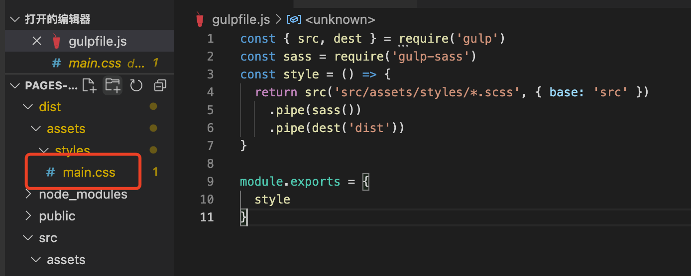

## 简答题

**1、谈谈你对工程化的初步认识，结合你之前遇到过的问题说出三个以上工程化能够解决问题或者带来的价值。**

答: 
### 自动化的主要解决的痛点
1. 传统语言或语法的弊端
  * ex: 以前端为例，不同浏览器的兼容问题，css需要对浏览器加各种前缀，-webkit // 谷歌、safari  -moz // 火狐 -o //Opera -ms //IE等，通过工程化可以自动实现这些功能（PostCss,  Autoprefixer)
  * 对于js的兼容问题，ECMAScript支持，可以通过babel对ES2015以上的语法，编译成通用的es5代码，可以使低版本浏览器可以执行
2. 大量手动重复、机械式的工作
  * 开发创建统一的样式
  * 书写代码统一的格式
  * 提交仓库，打包编译部署一个命令行解决
3. 开发团队成员代码风格的不统一
  * 常见的就是eslint，统一编码规范与提交规范
  * 各种css预编译工具，可以统一代码的样式规范，常见的如less sass等统一variable与mixins等。
4. 前端项目开发依赖于后端服务接口的支持
  * 无需后端开发完成接口，在同一联调
  * 前端也可以自己定义字段（看谁的周期快）
  * 通过mock进行交互，模拟真实交互场景
  * 无需把前端代码升级到服务器，可以用本地node启动服务，做代理解决跨域问题（如：webpack-dev-server）
5. 无法使用组件化、模块化
  * 可以将功能组件化，通过npm统一管理，可以再不同项目同时使用该功能，减少开发周期，降低bug。

　

　

**2、你认为脚手架除了为我们创建项目结构，还有什么更深的意义？**

答:
* 脚手架使功能简单化，比如创建个项目，只需要安装一个脚手架，按照命令进行执行，可以傻瓜式操作，可以降低学习成本，实现渐进式学习。
* 脚手架可以减少自己搭建项目的错误。
* 脚手架可以提高开发效率，一个简单的命令比手动添加快好几倍的效率，而且不容易出错（如plop创建模板文件）

　

　

## 编程题

**1、概述脚手架实现的过程，并使用 NodeJS 完成一个自定义的小型脚手架工具**
  ## 开发环境 node v14.16.0 系统macOS
  ### 1. 创建文件
  ```js
    mkdir generator-lastbee-vue
  ```
  ### 2. 进入generator-lastbee-vuecli文件夹
  ```js
    cd generator-lastbee-vue
  ```
  ### 3. 初始化package.json
  ```js
    yarn init // npm init(后面全用yarn)
  ```
  ### 4. 安装yeoman-generator 提供工具函数
  ```js
  yarn add yeoman-generator
  ```
  ### 5. 用 vscode 打开当前的目录
  ```js
  code .
  ```
  ### 6. 新建Generator的主入口文件 点击新建文件 generators/app/index.js

```js
  // 载入Genrator
  const Generator = require('yeoman-generator')
  const path = require('path')
  // 批量导入模板
  const templatePath = require('../templatePath')
  module.exports = class extends Generator {
    prompting() {// 询问问题
      return this.prompt([
        {
          type: 'input',
          name: 'name',
          message: 'Your project name',
          default: this.appname
        }
      ]).then(answers => {
        // 拿到prompting的返回值
        this.answers = answers
      })
    }

    writing() {
      // 批量导入templates模板的地址
      const templates = templatePath(path.resolve(__dirname, './app/templates'))
      // 循环批量生成文件
      templates.forEach(item => {
        // item => 每个模板的路径
        this.fs.copyTpl(
          this.templatePath(item),
          this.destinationPath(item),
          this.answers
        )
      })
    }
  }
```
### 实现templatePath.js 
```js
module.exports = (route) => {
  const list = [] // 路径列表
  const fs = require("fs") // 导入fs模块
  const path = require('path') // 导入path模块
  const readDir = (entry) => {
    const dirInfo = fs.readdirSync(entry);// 同步获取该目录下的所有文件
    dirInfo.forEach(item=>{// 遍历返回结果
      const location = path.join(entry,item);
      const info = fs.statSync(location);// 获取文件信息
      if(info.isDirectory()){// 如果是文件夹，递归
        readDir(location);
      }else{
        list.push(location) // 如果是文件push list
      }
    })
  }
  readDir(route)
  // 正则匹配templates下的路径地址，（?<=）匹配不捕获
  return list.map(item => item.match(/(?<=templates\/)(.*)/g)[0])
}
```
### link到全局
```js
  yarn link
```
### 发布到npm
```js
  npm login
  npm publish
```
### 发布成功
[generator-lastbee-vue 的 npm 地址](https://www.npmjs.com/package/generator-lastbee-vue)
　

**2、尝试使用 Gulp 完成项目的自动化构建**  ( **[先要作的事情](https://gitee.com/lagoufed/fed-e-questions/blob/master/part2/%E4%B8%8B%E8%BD%BD%E5%8C%85%E6%98%AF%E5%87%BA%E9%94%99%E7%9A%84%E8%A7%A3%E5%86%B3%E6%96%B9%E5%BC%8F.md)** )

(html,css,等素材已经放到code/pages-boilerplate目录)

　
## 创建Glup自动化构建
### 准备工作
* 安装grup
```js
  yarn add grup --dev
```
* 项目根目录创建 gulpfile.js 文件
### 编译scss
```js
  const { src, dest } = require('gulp')

  const style = () => {
    return src('src/assets/styles/*.scss').pipe(dest('dist'))
  }

  module.exports = {
    style
  }
```


* 根目录下会多出dist目录，scss文件路径不匹配, 设置base为 src
```js
  const { src, dest } = require('gulp')

  const style = () => {
    return src('src/assets/styles/*.scss', { base: 'src' }).pipe(dest('dist'))
  }

  module.exports = {
    style
  }
```


* 文件目录是正确的的，dist上一次的文件没有被清空，后面添加del就可以了
* 对scss进行编译
* yarn 安装gulp-sass


```js
  const { src, dest } = require('gulp')
  const sass = require('gulp-sass')
  const style = () => {
    return src('src/assets/styles/*.scss', { base: 'src' })
      .pipe(sass())
      .pipe(dest('dist'))
  }

  module.exports = {
    style
  }
```
* yarn gulp style
* 只有一个main.css，有下划线会认为是依赖文件，不会生成单独文件

### script 编译
* yarn add gulp-babel @babel/core @babel/preset-env --dev
```js
  const babel = require('gulp-babel')

  const script = () => {
    return src('src/assets/scripts/*.js', { base: 'src' })
      .pipe(babel({
        presets: ['@babel/preset-env']
      }))
      .pipe(dest('dist'))
  }
```
### 页面模板编译
* yarn add gulp-swig --dev
```js
  const page = () => {
    return src('src/*.html', { base: 'src' })
      .pipe(swig())
      .pipe(dest('dist'))
  }
```

### 创建组合任务
```js
  const { parallel } = require('gulp')
  // 创建组合任务
  const compile = parallel(style, script, page)

  module.exports = {
    compile
  }
```

### 压缩图片与字体
* yarn add gulp-imagemin --dev
```js
// 压缩图片，无损压缩，删除图片的原始信息
const image = () => {
  return src('src/assets/images/**', { base: 'src' })
    .pipe(imagemin())
    .pipe(dest('dist'))
}

const font = () => {
  return src('src/assets/fonts/**', { base: 'src' })
    .pipe(imagemin())
    .pipe(dest('dist'))
}
```
### 额外的copy任务与组合build命令
```js
const extra = () => {
  return src('public/**', { base: 'public' })
    .pipe(dest('dist'))
}

const compile = parallel(style, script, page, image, font)
const build = parallel(compile, extra)

module.exports = {
  build
}
```
### 创建clean任务
* yarn add del --dev
```js
const { series } = require('gulp')
const del = require('del')

const clean = () => {
  return del(['dist'])
}
// clean之后进行操作
const build = series(clean, parallel(compile, extra))

module.exports = {
  build,
  clean
}
```
### 自动加载插件
* yarn add gglup-load-plugins
```js
  const { src, dest, parallel, series } = require('gulp')
  const loadPlugins = require('gulp-load-plugins')
  const plugins = loadPlugins()

  // const plugins.sass = require('gulp-sass')
  // const plugins.babel = require('gulp-babel')
  // const plugins.swig = require('gulp-swig')
  // const plugins.imagemin = require('gulp-imagemin')
  // const plugins.del = require('del')


  const data = {
    menus: [
      {
        name: 'Home',
        icon: 'aperture',
        link: 'index.html'
      },
      {
        name: 'Features',
        link: 'features.html'
      },
      {
        name: 'About',
        link: 'about.html'
      },
      {
        name: 'Contact',
        link: '#',
        children: [
          {
            name: 'Twitter',
            link: 'https://twitter.com/w_zce'
          },
          {
            name: 'About',
            link: 'https://weibo.com/zceme'
          },
          {
            name: 'divider'
          },
          {
            name: 'About',
            link: 'https://github.com/zce'
          }
        ]
      }
    ],
    pkg: require('./package.json'),
    date: new Date()
  }

  const style = () => {
    return src('src/assets/styles/*.scss', { base: 'src' })
      .pipe(plugins.sass({ outputStyle: 'expanded' }))
      .pipe(dest('dist'))
  }

  const script = () => {
    return src('src/assets/scripts/*.js', { base: 'src' })
      .pipe(plugins.babel({
        presets: ['@babel/preset-env']
      }))
      .pipe(dest('dist'))
  }

  const page = () => {
    return src('src/*.html', { base: 'src' })
      .pipe(plugins.swig({ data }))
      .pipe(dest('dist'))
  }

  const image = () => {
    return src('src/assets/images/**', { base: 'src' })
      .pipe(plugins.imagemin())
      .pipe(dest('dist'))
  }

  const font = () => {
    return src('src/assets/fonts/**', { base: 'src' })
      .pipe(plugins.imagemin())
      .pipe(dest('dist'))
  }

  const extra = () => {
    return src('public/**', { base: 'public' })
      .pipe(dest('dist'))
  }
  // 创建组合任务
  const compile = parallel(style, script, page, image, font)

  const clean = () => {
    return plugins.del(['dist'])
  }

  const build = series(clean, parallel(compile, extra))

  module.exports = {
    build
  }
```
### 开发服务器
* yarn add browser-sync --dev
```js
  const bs = require('browser-sync')

  const serve = () => {
    watch('src/assets/styles/*.scss', style)
    watch('src/assets/scripts/*.js', script)
    watch('src/*.html', page)
    watch('src/assets/images/**', image)
    watch('src/assets/fonts/**', font)
    watch('public', extra)
    
    bs.init({
      port: '9000',
      notify: false,
      files: 'dist/*',
      server: {
        baseDir: 'dist',
        routes: {'/node_modules': 'node_modules'}
      }
    })
  }
```
### 文件压缩
* yarn add gulp-htmlmin gulp-uglify gulp-clean-css --dev
* yarn add gulp-if --dev
```js
  const useref = () => {
  return src('dist/*.html')
    .pipe(plugins.useref({ searchPath: ['dist', '.'] }))
    // 文件压缩
    .pipe(plugins.if(/\.js$/, plugins.uglify()))
    .pipe(plugins.if(/\.css$/, plugins.cleanCss()))
    .pipe(plugins.if(/\.html$/, plugins.htmlmin({ collapseWhitespace: true, minifyCSS: true, minifyJS: true })))
    .pipe(dest('release'))
}
```
### uesref 文件引入处理
* yarn add gulp-useref --dev
* page script style会先compile一个临时temp目录
* build 过程先执行compile 在执行 useref series(compile, useref)

```js

const { src, dest, parallel, series, watch } = require('gulp')
// const watch = require("gulp-watch");
const loadPlugins = require('gulp-load-plugins')
const plugins = loadPlugins()

const bs = require('browser-sync').create()
const sass = require('gulp-sass')
// const plugins.babel = require('gulp-babel')
// const plugins.swig = require('gulp-swig')
// const plugins.imagemin = require('gulp-imagemin')
const del = require('del')


const data = {
  menus: [
    {
      name: 'Home',
      icon: 'aperture',
      link: 'index.html'
    },
    {
      name: 'Features',
      link: 'features.html'
    },
    {
      name: 'About',
      link: 'about.html'
    },
    {
      name: 'Contact',
      link: '#',
      children: [
        {
          name: 'Twitter',
          link: 'https://twitter.com/w_zce'
        },
        {
          name: 'About',
          link: 'https://weibo.com/zceme'
        },
        {
          name: 'divider'
        },
        {
          name: 'About',
          link: 'https://github.com/zce'
        }
      ]
    }
  ],
  pkg: require('./package.json'),
  date: new Date()
}

const style = () => {
  return src('src/assets/styles/*.scss', { base: 'src' })
    .pipe(sass({ outputStyle: 'expanded' }))
    .pipe(dest('temp'))
    .pipe(bs.reload({ stream: true }))
}

const script = () => {
  return src('src/assets/scripts/*.js', { base: 'src' })
    .pipe(plugins.babel({
      presets: ['@babel/preset-env']
    }))
    .pipe(dest('temp'))
    .pipe(bs.reload({ stream: true }))
}

const page = () => {
  return src('src/*.html', { base: 'src' })
    .pipe(plugins.swig({ data }))
    .pipe(dest('temp'))
    .pipe(bs.reload({ stream: true }))
}

const image = () => {
  return src('src/assets/images/**', { base: 'src' })
    .pipe(plugins.imagemin())
    .pipe(dest('dist'))
}

const font = () => {
  return src('src/assets/fonts/**', { base: 'src' })
    .pipe(plugins.imagemin())
    .pipe(dest('dist'))
}

const extra = () => {
  return src('public/**', { base: 'public' })
    .pipe(dest('dist'))
}


const clean = () => {
  return del(['dist', 'temp'])
}
const serve = () => {
  watch('src/assets/styles/*.scss', style)
  watch('src/assets/scripts/*.js', script)
  watch('src/*.html', page)
  watch(['src/assets/fonts/**','src/assets/images/**'],bs.reload)
  // watch('src/assets/images/**', image)
  // watch('src/assets/fonts/**', font)
  // watch('public', extra)

  bs.init({
    port: '9000',
    notify: false,
    // files: 'dist',
    server: {
      baseDir: ['temp', 'src', 'public'],
      routes: {'/node_modules': 'node_modules'}
    }
  })
}

const useref = () => {
  return src('temp/*.html')
    .pipe(plugins.useref({ searchPath: ['temp', '.'] }))
    // 文件压缩
    .pipe(plugins.if(/\.js$/, plugins.uglify()))
    .pipe(plugins.if(/\.css$/, plugins.cleanCss()))
    .pipe(plugins.if(/\.html$/, plugins.htmlmin({ collapseWhitespace: true, minifyCSS: true, minifyJS: true })))
    .pipe(dest('dist'))
}


// 创建组合任务
const compile = parallel(style, script, page)
const build = series(clean, parallel(series(compile, useref), image, font, extra))
const develop = series(compile, serve)
module.exports = {
  clean,
  build,
  develop
}

```


## 说明：

本次作业中的编程题要求大家完成相应代码后

- 提交一个项目说明文档，要求思路流程清晰。
- 或者简单录制一个小视频介绍一下实现思路，并演示一下相关功能。
- 说明文档和代码统一提交至作业仓库。