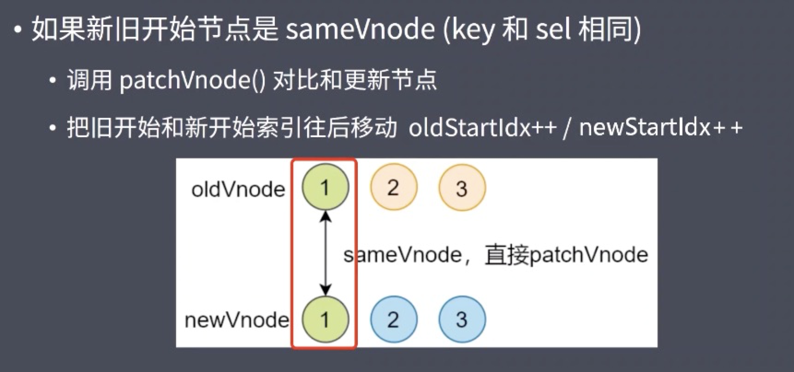
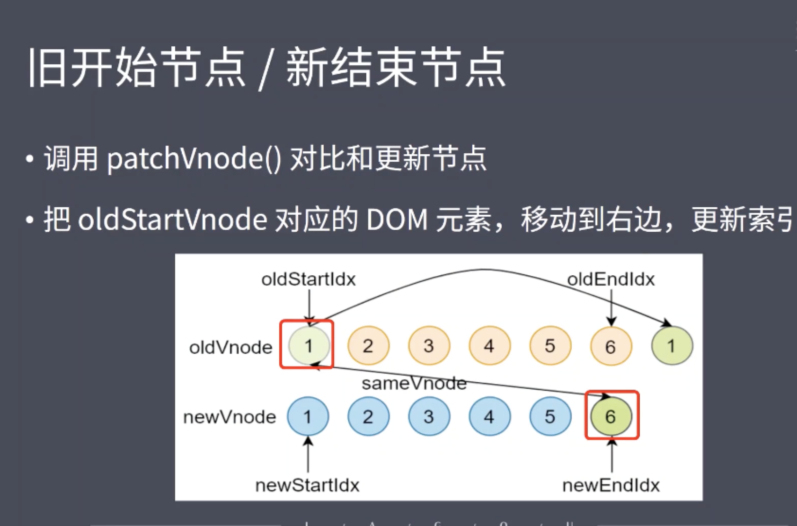
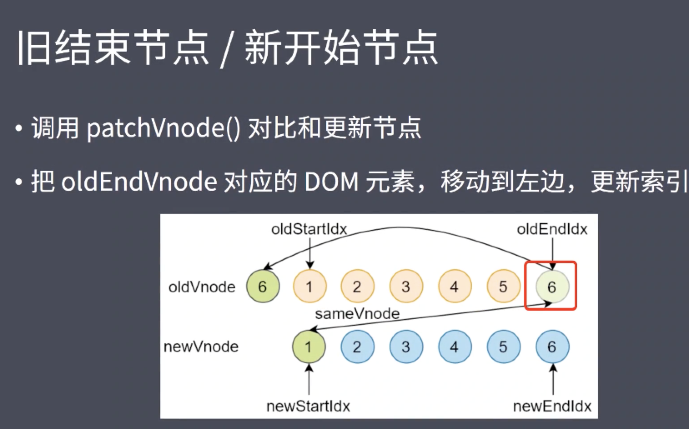
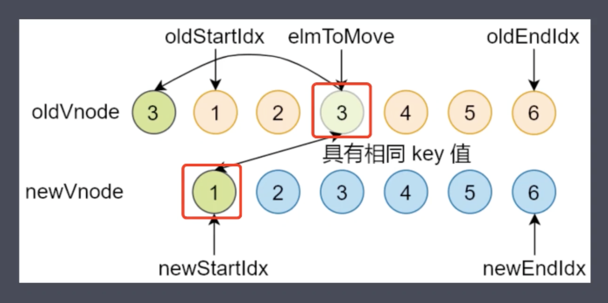
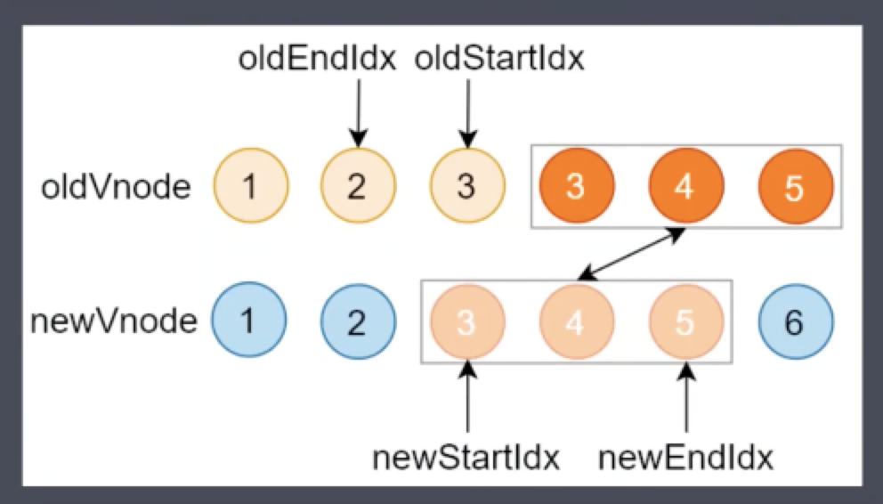
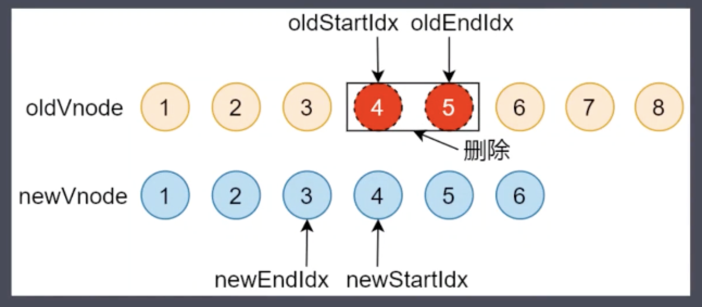

## 一、简答题

### 1、当我们点击按钮的时候动态给 data 增加的成员是否是响应式数据，如果不是的话，如何把新增成员设置成响应式数据，它的内部原理是什么。

```js
let vm = new Vue({
 el: '#el'
 data: {
  o: 'object',
  dog: {}
 },
 method: {
  clickHandler () {
   // 该 name 属性是否是响应式的
   this.dog.name = 'Trump'
  }
 }
})
```
* this.dog.name 不是响应式数据， 在vue初始化的过程中，只会把data内的数据变成响应式。如果data内的对象添加子属性不是响应式数据的。可以通过this.$set(this.dog, 'name', 'Trump')的方式为dog动态添加响应式属性。
* 原理：vue原理中，Vue.set方法会调用object.defineProperty使属性实现getter与setter从而变成响应式数据
 　

　

　


### 2、请简述 Diff 算法的执行过程
* diff算法就是调用patch函数，比较新旧两个节点进行打补丁的过程
1. 根据isVnode方法判断oldVnode是否为vnode节点，如果不是的话，在emptyNodeAt调用vnode函数转换成vnode
2. 根据sameVnode方法判断是否为相同节点 （key与sel是否相同）
  * 如果是相同节点，调用patchVnode方法，对比内容是否变化（diff）
  * 如果是否，获取oldVnode的dom元素，获取elm的父元素，通过createElm创建新节点的dom元素，新dom插入parent，然后删除旧节点
3. 主要分析一下节点相同的情况，这就是diff的主要执行过程
  * 如果都有子节点执行updateChildren
  * 开始结束节点比较分为四种情况
    * 新旧开始节点是sameVnode -> 调用patchVnode对比更新节点，把旧开始节点与新开始索引往后移动
    * 新旧结束节点是sameVnode -> 从后往前比较 -> 如果是调用patchVnode对比更新节点 -> 往前移动
    

    * 就开始节点与新结束节点sameVnode -> 调用patchVnode对比更新节点 -> 把旧节点往右移动 更新索引
    

    * 旧结束节点与新开始节点 -> 调用patchVnode对比更新节点 -> 把旧节点往左移动 更新索引
    

  * 非上面四种情况
    * 遍历新节点开始节点，是否有旧sameVnode，如果否则创建，如果是的话，则把旧节点elemToMove
    

    * 当老节点的子节点先遍历完（oldStartIdx > oldEndIdx），循环结束（移动新节点到旧节点之间）
    

    * 新节点的所有子节点先遍历完（newStartIdx > newEndIdx）, 循环结束（去除剩余旧节点）
    

　

　

　


 

## 二、编程题

### 1、模拟 VueRouter 的 hash 模式的实现，实现思路和 History 模式类似，把 URL 中的 # 后面的内容作为路由的地址，可以通过 hashchange 事件监听路由地址的变化。

 　
```js
let _Vue = null
class VueRouter {
    static install(Vue){
        //1 判断当前插件是否被安装
        if(VueRouter.install.installed){
            return;
        }
        VueRouter.install.installed = true
        //2 把Vue的构造函数记录在全局
        _Vue = Vue
        //3 把创建Vue的实例传入的router对象注入到Vue实例
        // _Vue.prototype.$router = this.$options.router
        _Vue.mixin({
            beforeCreate(){
                if(this.$options.router){
                    _Vue.prototype.$router = this.$options.router
                    
                }
               
            }
        })
    }
    constructor(options){
        this.options = options
        this.routeMap = {}
        // observable
        this.data = _Vue.observable({
            current:"/"
        })
        this.init()

    }
    init(){
        this.createRouteMap()
        this.initComponent(_Vue)
        this.initEvent()
    }
    createRouteMap(){
        //遍历所有的路由规则 吧路由规则解析成键值对的形式存储到routeMap中
        this.options.routes.forEach(route => {
            this.routeMap[route.path] = route.component
        });
    }
    initComponent(Vue){
        Vue.component("router-link",{
            props:{
                to:String
            },
            render(h){
                return h("a",{
                    attrs:{
                        href:'#' + this.to
                    },
                    on:{
                        click:this.clickhander
                    }
                },[this.$slots.default])
            },
            methods:{
                clickhander(e){
                    // history.pushState({},"",this.to)
                    window.location.hash = '#' + this.to
                    this.$router.data.current=this.to
                    e.preventDefault()
                }
            }
            // template:"<a :href='to'><slot></slot><>"
        })
        const self = this
        Vue.component("router-view",{
            render(h){
                // self.data.current
                const cm=self.routeMap[self.data.current]
                return h(cm)
            }
        })
        
    }
    initEvent(){
        //
        // window.addEventListener("popstate",()=>{
        //     this.data.current = window.location.pathname
        // })
        window.addEventListener('hashchange', () => {
          this.data.current = window.location.hash.substr(1)
        })
    }
}


export default VueRouter
```
　

### 2、在模拟 Vue.js 响应式源码的基础上实现 v-html 指令，以及 v-on 指令。

 ```js
 class Compiler {
  constructor (vm) {
    this.el = vm.$el
    this.vm = vm
    this.compile(this.el)
  }
  // 编译模板，处理文本节点和元素节点
  compile (el) {
    let childNodes = el.childNodes
    Array.from(childNodes).forEach(node => {
      // 处理文本节点
      if (this.isTextNode(node)) {
        this.compileText(node)
      } else if (this.isElementNode(node)) {
        // 处理元素节点
        this.compileElement(node)
      }

      // 判断node节点，是否有子节点，如果有子节点，要递归调用compile
      if (node.childNodes && node.childNodes.length) {
        this.compile(node)
      }
    })
  }
  // 编译元素节点，处理指令
  compileElement (node) {
    // console.log(node.attributes)
    // 遍历所有的属性节点
    Array.from(node.attributes).forEach(attr => {
      // 判断是否是指令
      let attrName = attr.name
      if (this.isDirective(attrName)) {
        // v-text --> text
        attrName = attrName.substr(2)
        let key = attr.value
        if(attrName.indexOf(':') !== -1) {
          let eventType = attrName.split(':')[1]
          this.handleEvent(this,node,eventType,key)
          return
        }
        this.update(node, key, attrName)
      }
    })
  }
  handleEvent(vm,node,eventType,eventName){
    node.addEventListener(eventType,()=>{
        vm.vm.$options.methods[eventName]()
    })
  }
  update (node, key, attrName) {
    let updateFn = this[attrName + 'Updater']
    updateFn && updateFn.call(this, node, this.vm[key], key)
  }

  // 处理 v-on事件
  onUpdater(node, key, event) {
    console.log(node, key, event)
  }

  // 处理v-html 指令
  htmlUpdater(node, value, key) {
    node.innerHTML = value
    new Watcher(this.vm, key, (newValue) => {
      node.innerHTML = newValue
    })
  }
  // 处理 v-text 指令
  textUpdater (node, value, key) {
    node.textContent = value
    new Watcher(this.vm, key, (newValue) => {
      node.textContent = newValue
    })
  }
  // v-model
  modelUpdater (node, value, key) {
    node.value = value
    new Watcher(this.vm, key, (newValue) => {
      node.value = newValue
    })
    // 双向绑定
    node.addEventListener('input', () => {
      this.vm[key] = node.value
    })
  }

  // 编译文本节点，处理差值表达式
  compileText (node) {
    // console.dir(node)
    // {{  msg }}
    let reg = /\{\{(.+?)\}\}/
    let value = node.textContent
    if (reg.test(value)) {
      let key = RegExp.$1.trim()
      node.textContent = value.replace(reg, this.vm[key])

      // 创建watcher对象，当数据改变更新视图
      new Watcher(this.vm, key, (newValue) => {
        node.textContent = newValue
      })
    }
  }
  // 判断元素属性是否是指令
  isDirective (attrName) {
    return attrName.startsWith('v-')
  }
  // 判断节点是否是文本节点
  isTextNode (node) {
    return node.nodeType === 3
  }
  // 判断节点是否是元素节点
  isElementNode (node) {
    return node.nodeType === 1
  }  
}
 ```

　

### 3、参考 Snabbdom 提供的电影列表的示例，利用Snabbdom 实现类似的效果，如图：


```js
  import { init } from 'snabbdom/build/package/init'
import { h } from 'snabbdom/build/package/h'
import { attributesModule } from 'snabbdom/build/package/modules/attributes'
import { eventListenersModule } from 'snabbdom/build/package/modules/eventlisteners'
import { styleModule } from 'snabbdom/build/package/modules/style'
import { classModule } from 'snabbdom/build/package/modules/class'
let patch = init([attributesModule, eventListenersModule, styleModule, classModule])
var vnode

var nextKey = 11
var margin = 8
var sortBy = 'rank'
var totalHeight = 0
var originalData = [
  { rank: 1, title: 'The Shawshank Redemption', desc: 'Two imprisoned men bond over a number of years, finding solace and eventual redemption through acts of common decency.', elmHeight: 0 },
  { rank: 2, title: 'The Godfather', desc: 'The aging patriarch of an organized crime dynasty transfers control of his clandestine empire to his reluctant son.', elmHeight: 0 },
  { rank: 3, title: 'The Godfather: Part II', desc: 'The early life and career of Vito Corleone in 1920s New York is portrayed while his son, Michael, expands and tightens his grip on his crime syndicate stretching from Lake Tahoe, Nevada to pre-revolution 1958 Cuba.', elmHeight: 0 },
  { rank: 4, title: 'The Dark Knight', desc: 'When the menace known as the Joker wreaks havoc and chaos on the people of Gotham, the caped crusader must come to terms with one of the greatest psychological tests of his ability to fight injustice.', elmHeight: 0 },
  { rank: 5, title: 'Pulp Fiction', desc: 'The lives of two mob hit men, a boxer, a gangster\'s wife, and a pair of diner bandits intertwine in four tales of violence and redemption.', elmHeight: 0 },
  { rank: 6, title: 'Schindler\'s List', desc: 'In Poland during World War II, Oskar Schindler gradually becomes concerned for his Jewish workforce after witnessing their persecution by the Nazis.', elmHeight: 0 },
  { rank: 7, title: '12 Angry Men', desc: 'A dissenting juror in a murder trial slowly manages to convince the others that the case is not as obviously clear as it seemed in court.', elmHeight: 0 },
  { rank: 8, title: 'The Good, the Bad and the Ugly', desc: 'A bounty hunting scam joins two men in an uneasy alliance against a third in a race to find a fortune in gold buried in a remote cemetery.', elmHeight: 0 },
  { rank: 9, title: 'The Lord of the Rings: The Return of the King', desc: 'Gandalf and Aragorn lead the World of Men against Sauron\'s army to draw his gaze from Frodo and Sam as they approach Mount Doom with the One Ring.', elmHeight: 0 },
  { rank: 10, title: 'Fight Club', desc: 'An insomniac office worker looking for a way to change his life crosses paths with a devil-may-care soap maker and they form an underground fight club that evolves into something much, much more...', elmHeight: 0 },
]

var data = [
  originalData[0],
  originalData[1],
  originalData[2],
  originalData[3],
  originalData[4],
  originalData[5],
  originalData[6],
  originalData[7],
  originalData[8],
  originalData[9],
]

function changeSort (prop) {
  sortBy = prop
  data.sort((a, b) => {
    if (a[prop] > b[prop]) {
      return 1
    }
    if (a[prop] < b[prop]) {
      return -1
    }
    return 0
  })
  render()
}
function add () {
  var n = originalData[Math.floor(Math.random() * 10)]
  data = [{ rank: nextKey++, title: n.title, desc: n.desc, elmHeight: 0 }].concat(data)
  render()
  render()
}

function render () {
  data = data.reduce((acc, m) => {
    var last = acc[acc.length - 1]
    m.offset = last ? last.offset + last.elmHeight + margin : margin
    return acc.concat(m)
  }, [])
  totalHeight = data.length === 0
    ? 0
    : data[data.length - 1].offset + data[data.length - 1].elmHeight
  vnode = patch(vnode, view(data))
}
function movieView (movie) {
  return h('div.row', {
    key: movie.rank,
    style: {
      opacity: '0',
      transform: 'translate(-200px)',
      delayed: { transform: `translateY(${movie.offset}px)`, opacity: '1' },
      remove: { opacity: '0', transform: `translateY(${movie.offset}px) translateX(200px)` }
    },
    hook: { insert: (vnode) => { movie.elmHeight = vnode.elm.offsetHeight } },
  }, [
    h('div', { style: { fontWeight: 'bold' } }, movie.rank),
    h('div', movie.title),
    h('div', movie.desc),
    h('div.btn.rm-btn', { on: { click: () => { remove(movie) } } }, 'x'),
  ])
}

function remove (movie) {
  data = data.filter((m) => {
    return m !== movie
  })
  render()
}

function movieView (movie) {
  return h('div.row', {
    key: movie.rank,
    style: {
      opacity: '0',
      transform: 'translate(-200px)',
      delayed: { transform: `translateY(${movie.offset}px)`, opacity: '1' },
      remove: { opacity: '0', transform: `translateY(${movie.offset}px) translateX(200px)` }
    },
    hook: { insert: (vnode) => { movie.elmHeight = vnode.elm.offsetHeight } },
  }, [
    h('div', { style: { fontWeight: 'bold' } }, movie.rank),
    h('div', movie.title),
    h('div', movie.desc),
    h('div.btn.rm-btn', { on: { click: () => { remove(movie) } } }, 'x'),
  ])
}
function view (data) {
  return h('div', [
    h('h1', 'Top 10 movies'),
    h('div', [
      h('a.btn.add', { on: { click: add } }, 'Add'),
      'Sort by: ',
      h('span.btn-group', [
        h('a.btn.rank', { class: { active: sortBy === 'rank' }, on: { click: () => { changeSort('rank') }} }, 'Rank'), 
        h('a.btn.title', { class: { active: sortBy === 'title' }, on: { click: () => { changeSort('title') } } }, 'Title'),
        h('a.btn.desc', { class: { active: sortBy === 'desc' }, on: { click: () =>{ changeSort('desc') } } }, 'Description'),
      ]),
    ]),
    h('div.list', { style: { height: totalHeight + 'px' } }, data.map(movieView)),
  ])
}

window.addEventListener('DOMContentLoaded', () => {
  var container = document.getElementById('app')
  vnode = patch(container, view(data))
  render()
})


```

* 详情见code文件夹