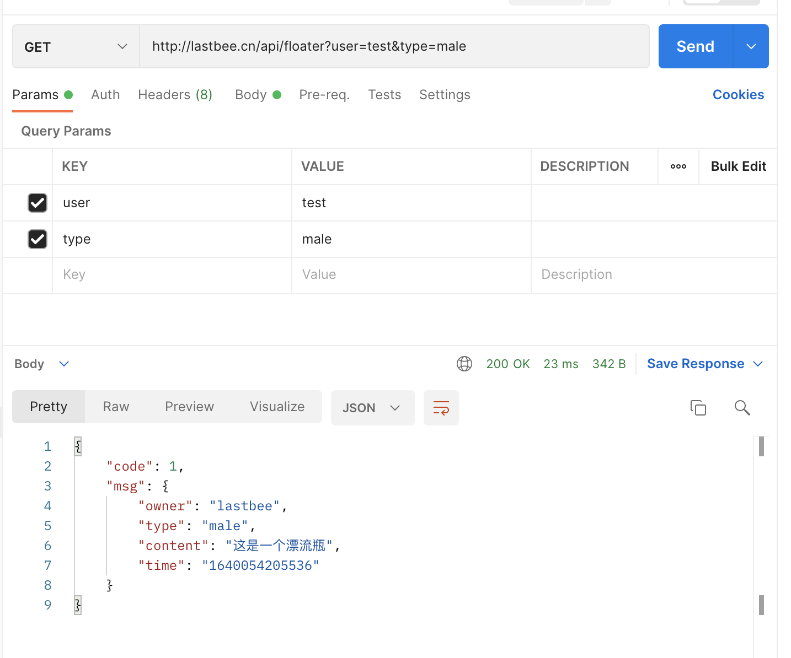

## 获取漂流瓶
* method: GET
* url: http://lastbee.cn/api/floater
* params: user=test&type=male
* result: 

## 生成漂流瓶
* method: POST
* url: http://lastbee.cn/api/floater
* query: {
   "owner": "lastbee",
   "type": "male",
   "content": "这是一个漂流瓶"
}
* result: 